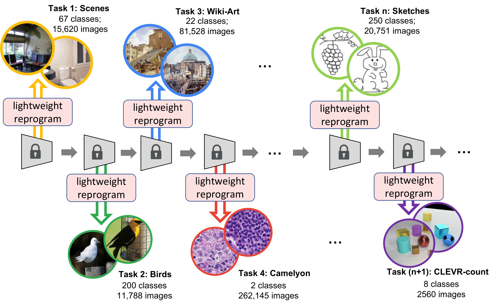
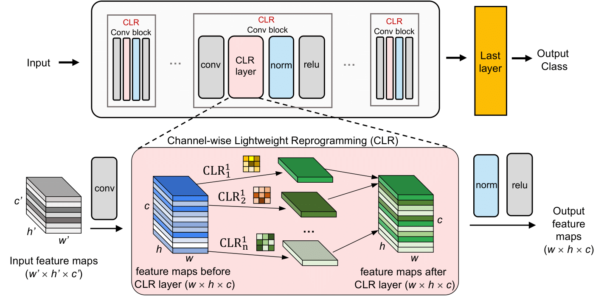

# Channel-wise-Lightweight-Reprogramming
[ICCV 2023] CLR: Channel-wise Lightweight Reprogramming for Continual Learning

### [Project Page(pending)](http://ilab.usc.edu/) | [Video(pending)](https://youtu.be/) | [Paper](https://arxiv.org/pdf/2307.11386.pdf)

> **CLR: Channel-wise Lightweight Reprogramming for Continual Learning** <br>
> Yunhao Ge, Yuecheng Li, Shuo Ni, Jiaping Zhao, Ming-Hsuan Yang, Laurent Itti <br>
> *ICCV*

<div align="center">
    
</div>

**Figure:** *Equipped with a task-agnostic immutable CNN model, our approach "reprogram" the CNN layers to each new task with lightweight task-specific parameters (less than 0.6% of the original model) to learn sequences of disjoint tasks, assuming data from previous tasks is no longer available while learning new tasks.*

We propose a Channel-wise Lightweight Reprogramming (CLR) approach that helps convolutional neural networks (CNNs) overcome catastrophic forgetting during continual learning. We show that a CNN model trained on an old task (or self-supervised proxy task) could be "reprogrammed" to solve a new task by using our proposed lightweight (very cheap) reprogram- ming parameter. With the help of CLR, we have a better stability-plasticity trade-off to solve continual learning problems: To maintain stability and retain previous task ability, we use a common task-agnostic immutable part as the shared “anchor” parameter set. We then add task-specific lightweight reprogramming parameters to reinterpret the outputs of the immutable parts, to enable plasticity and integrate new knowledge

<div align="center">
    
</div>

**Figure:** *Proposed continual learning model with channel-wise lightweight reprogramming (CLR) layers. All gray blocks are fixed parameters. (top) General network architecture. (bottom) Details of CLR reprogramming layer: for each channel k ∈ [1..c] of an original w × h × c feature map (blue), a 3x3 kernel is learned to reprogram the feature towards the new task (green), without modifying the original conv parameters (grey).*


## Getting starged

### Installation
```
git clone https://github.com/gyhandy/Channel-wise-Lightweight-Reprogramming.git
```

### Download file

#### Single file downloading option (~1.6T)
```
wget http://ilab.usc.edu/andy/skill-dataset/skill/SKILL-Dataset-backend.zip
unzip SKILL-Dataset-backend.zip
```

#### Multiple files downloading option(~600G per file)
```
wget http://ilab.usc.edu/andy/skill-dataset/separate-v/skill-dataset.z01
wget http://ilab.usc.edu/andy/skill-dataset/separate-v/skill-dataset.z02
wget http://ilab.usc.edu/andy/skill-dataset/separate-v/skill-dataset.zip
unzip skill-dataset.zip
```

### General directory structure

- `dataset/` contains code for declare `train_datasets`, `val_datasets`, `train_loaders`, and `val_loaders` for the DCT dataset, each is a list of 107 datasets contains in the DCT. You can also define your own `train_datasets`, `val_datasets`, `train_loaders`, and `val_loaders` for your own datasets. Place to change is commented in the main code

- `network/` contains models and specific customized layer used in the experiment

- `main.py` The main code needs to be run

- `stat.csv` The stats and subset id of the 53-task we used from DCT dataset. 

### Usage

#### argument

- `--result` the result path will store all the logs

- `--weight` the weight path which store the weight of the classifiers

- `--data` the path to store the data, **this should be where you unzip before**

- `--method` `Ghost_reduced_v1` refers to the main method in the paper while `Ghost` provides a slightly expensive version in memory cost, but come with a slight accuracy improvment

#### Sample run

- To run the standard version of CLR
```
python main.py --data <Folder where you unzip>
```
The result can be found in Figure 11 under column "CLR"

- To run a slight expanded version of CLR
```
python main.py --data <Folder where you unzip> --method Ghost
```
The result can be found in Figure 11 under column "CLR-Full"